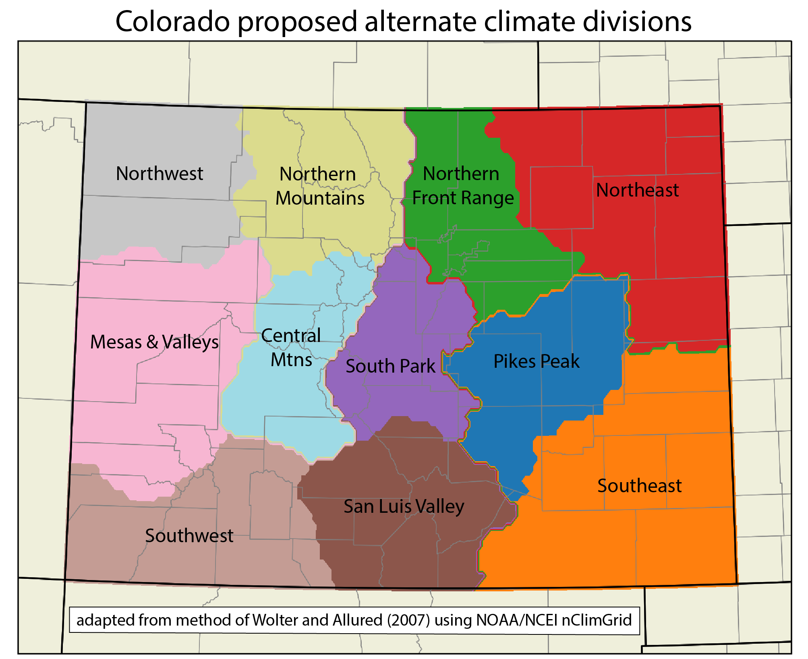

# CO_altclimdivs
Code used to develop alternate climate divisions for Colorado, based on gridded climate data

This repository includes the code associated with the analysis in the manuscript "Development of alternate climate divisions for Colorado based on gridded data", submitted to the Journal of Applied and Service Climatology. The method is adapted from [Wolter and Allured 2007](https://wwa.colorado.edu/sites/default/files/2021-09/IWCS_2007_Jun_feature.pdf), but applied here to gridded data, specifically NCEI's nClimGrid. This code, with relevant descriptions and comments, is in the Jupyter notebook [clusters_tavg_prcp_sum_post1950_publish.ipynb](clusters_tavg_prcp_sum_post1950_publish.ipynb).

To run this notebook and obtain the same results shown in the manuscript, the nClimGrid files obtained in April 2022, and subset to Colorado, must also be obtained from https://climate.colostate.edu/altclimdivs/nclimgrid_prcp_CO_forclusters.nc and https://climate.colostate.edu/altclimdivs/nclimgrid_tavg_CO_forclusters.nc.  However, the code could easily be modified to use nClimGrid data obtained directly from [NCEI](https://www.ncei.noaa.gov/thredds/catalog/data-in-development/nclimgrid/catalog.html), and subset to a different part of the continental US. 

Also included in the repository is a netCDF file that includes the final set of alternate climate divisions, shown below with names chosen by the authors.

